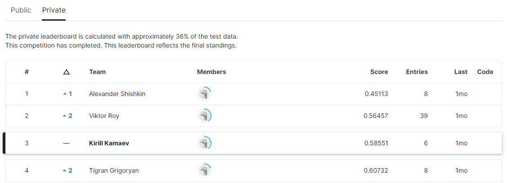
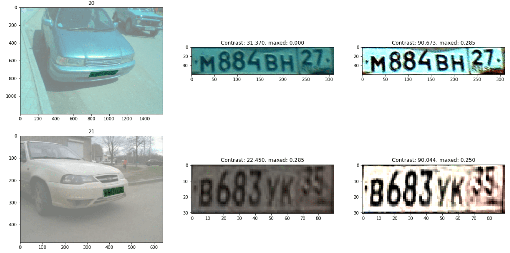

# Car plates OCR

## Kaggle private leaderboard result: 0.59 (3rd place)

## Описание решения:

### Detection

Везде брал 10% для валидации. В результате экспериментов длиной примерно в неделю (1 эпоха обучалась где-то 1.5 часа, получилось следующее:

#### Что зашло:
- mask-rcnn с resnet50 в качестве backbone
- обучен в течении 10 эпох с SGD оптимизитором стартовый lr=3e-4, lr_scheduler - ReduceLROnPlateau.
- augmentations:
    - Horizontal Flip
    - Perspective Transform - я решил, что нужно каким-то образом учитывать, что машина может быть сфотографирована под разным углом, поэтому сделал следующее:
        - выделяем рамку в изображении толщиной w%
        - если в эту рамку попали какие-то номера, то соответствующий край рамке делаем более тонким, так чтобы номер был полностью внутри рамки
        - Рамка по сути состоит из 4 полос (слева, справа, снизу, сверху) - эти полосы пересекаются в углах, образую 4 прямоугольника
        - Выбираем случайную точку в каждом из этих прямоугольников и используем их как вершину для PerspectiveTransform
- при каждом изменении lr - загружаем лучшую на данный момент модель

#### Что не зашло:
- Изменение размеров в AnchorGenerator - пробовал сделать размеры областей вытянутыми, чтобы они больше были похожи на те объекты, которые мы детектируем
- Изменение пропорции в loss'ах mask-rcnn
- Adam, AdamW - не дали ни скорости, ни лучшей сходимости чем самый простой SGD, возможно неудачно подобрал параметры

### Между detection и recognition

#### Что зашло:
- Обработка изображений:
    - Увеличение контрастности изображений (приводил к одному и тому же значению контрастности)
    - Выравнивание баланса цветов (каждый канал отдельно преобразовывался так чтобы <=15% пикселей были равны 0 или 255, а остальные растягивались на весь промежуток)
    - Увеличение резкости с использованием гауссиана (изображение размывается гауссианом, а затем размытое, умноженное на константу, вычитается из исходного изображения)

    Пример результата обработки изображения:

    

    

- Преобразование из маски в прямоугольное изображение с использованием PerspectiveTransform (с использованием opencv)
- Сохранение и mask и bbox (спасибо Алексею Ярошенко за идею в baseline)
- Сохранение данных для следующей стадии с размером 640x128 (чтобы не читать весь исходный датасет при каждом проходе при распознавании - ускорило процесс обучения Recognizer'а)

#### Что не зашло:

- Пробовал добавить в этот этап сеть-классификатор, чтобы с одной стороны уменьшить порог для детектора, но иметь возможность отсеивать "мусор" до распознавания - пробовал обучить классификатор на основе resnet18.

### Recognition

Использовал CRNN с CTC loss, с размером изображений 640x128. Обучал на ground true данных из train датасета (по 2 изображения для каждого номера - bbox и perspective transform его маски) Везде брал 10% для валидации.

- обучен в течении 20 эпох с Adam оптимизитором стартовый lr=3e-4, lr_scheduler - ReduceLROnPlateau.
- при каждом изменении lr - загружаем лучшую на данный момент модель.

#### Что зашло:

- Использовать 2 изображения для каждого номера при обучении
- При инференсе прогонять модель на bbox и на perspective transform из маски, а потом суммировать предсказания, получаем вектор логитов - preds
- Уверенность
    - Переводим логиты в "подобие вероятностей" с использованием софтмакса:probs = softmax(preds)
    - Для каждой буквы вычисляем std для "вероятностей" и находим среднее - получаем "уверенность" в том, что хорошо распознали номер. 
    - Если все символы были распознаны практически случайно - на каждой позиции не было символа "лидера", то есть модель не была уверена какой символ выбрать - то "уверенность" будет низкая
    - если жа наоборот на каждой позиции был символ с высокой уверенностью - то std будет больше и "уверенность" также будет больше.
    - Отсекал номера с низким показателем уверенность - предполагал, что это ошибки детектора и на самом деле номера там нет, или есть часть номера, а не весь номер целиком.
- beam search
- language model после CTC - сгенерировал все возможные варианты номерных знаков для всех существующих регионах и в качестве языковой модели использовал 2-3-4-5-граммы для предсказания вероятности следующего символа в последовательности.
